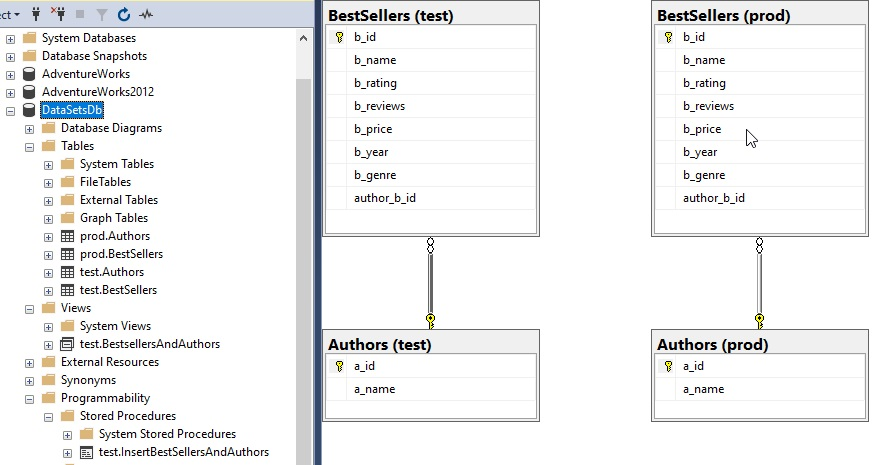

# datasets-with-sqlserver-python
Having fun with Kaggle data, SQL Server and Python (pyodbc).

## Information
### Links
SQL:

[Microsoft SQL documentation]https://docs.microsoft.com/en-us/sql/?view=sql-server-ver15

[SQL SERVER SSMS] https://docs.microsoft.com/en-us/sql/ssms/download-sql-server-management-studio-ssms?view=sql-server-ver15

Must check out this Azure Data Studio stuff

[

[Kaggle public datasets] https://www.kaggle.com/sootersaalu/amazon-top-50-bestselling-books-2009-2019?select=bestsellers+with+categories.csv

[PyODBC] https://pypi.org/project/pyodbc/

[PyODBC parameters] https://github.com/mkleehammer/pyodbc/wiki/Getting-started#parameters

ODBC supports parameters using a question mark as a place holder in the SQL. 
You provide the values for the question marks by passing them after the SQL.
This is safer than putting the values into the string because the parameters are passed to the database separately, 
protecting against SQL injection attacks. It is also be more efficient if you execute the same SQL repeatedly with different parameters. 
The SQL will be "prepared" only once. (pyodbc keeps only the last prepared statement, so if you switch between statements, each will be prepared multiple times.)

### Database Schemas
* The flat model is for small, simple applications
* The hierarchical model is for nested data, like XML or JSON
* The network model is useful in mapping and spatial data, also for depicting workflows
* The relational model best reflects Object-Oriented Programming applications
* The star schema and snowflake schema are for analyzing large datasets
* https://www.xplenty.com/blog/database-schema-examples/

TODO or Done's:
* DDL, bestsellers, author, f key on id 100%
* Db con 100%
* DB close
* https://stackoverflow.com/questions/3783238/python-database-connection-close
* TCP viewer and Wireshark check call's, close
* Logger 100%
* Datasets 100%
* Read file 100%
* Simulate keyvault 100%
* Insert bestsellers data 100%
* Prepared statment for data 80%
* T-SQL CRUD bestsellers data 50%
* T-SQL Advanced, Views,Joins, Procedure's, Merge etc
* TBD
* Tkinter GUI, MVC

EER of schema v1.1 test and prod for BestSellers from Kaggle (Amazon books)

[

## 1 How to ETL (Extract, Transform* and Load*) bestsellers with categories.csv Python, pyodbc and T-SQL

1. Create tables with crt_1_tables_bestsellers.sql in SSMS.
2. Create user CRUD rights with crt_user_grant.sql in SSMS (step 1, 2 and 3).
3. We use the test.table's first to verify before implementing the prod.table's.
4. Create test.InsertBestSellersAndAuthors or (prod.InsertBestSellersAndAuthors) procedure.
*   A note about the data:bestsellers with categories.csv from kaggle or here, it is just raw data.
*   The format must be (b for book, a for author); b_name, a_name, b_rating, b_reviews, b_price, b_year, b_genre.
5. Before we can insert we must do step the last step in crt_user_grant.sql in SSMS, step 4 grant exec on the procedure
6.  We then read the .csv and call the test.InsertBestSellersAndAuthors or (prod.InsertBestSellersAndAuthors) to insert data with the follwoing logic:
*   If it exists an author, we get the id and insert the book data with that f-key, else we insert author and book data with the new f-key.
7. We can now do data operations.
8. We then create a view on test, a inner join of both using the f-key.
9. We can now do more fun data operations.
10. We can now do the same in prod, repeat step 2 to 9 (the prod.table was created in 1, but grant must be done on prod.table's)
11. All data has now been prepared for the next step:

## 2 How to bestsellers T-SQL
