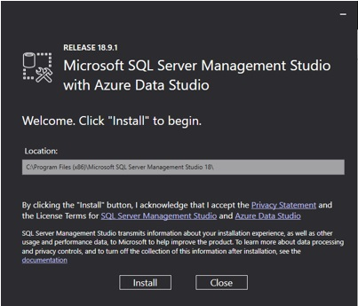
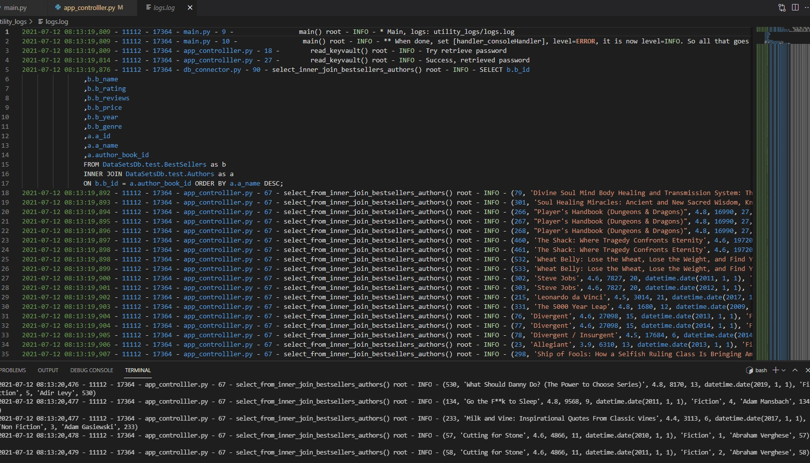
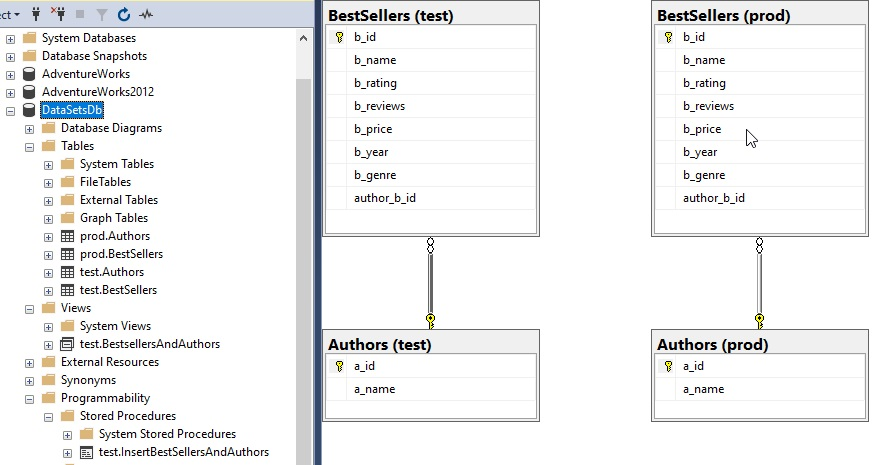

# datasets-with-sqlserver-python
Having fun with Kaggle data, SQL Server and Python (pyodbc).

## Links 
[SQL SERVER SSMS] https://docs.microsoft.com/en-us/sql/ssms/download-sql-server-management-studio-ssms?view=sql-server-ver15

[

[Kaggle public datasets] https://www.kaggle.com/sootersaalu/amazon-top-50-bestselling-books-2009-2019?select=bestsellers+with+categories.csv

[PyODBC] https://pypi.org/project/pyodbc/

[PyODBC parameters] https://github.com/mkleehammer/pyodbc/wiki/Getting-started#parameters

ODBC supports parameters using a question mark as a place holder in the SQL. 
You provide the values for the question marks by passing them after the SQL.
This is safer than putting the values into the string because the parameters are passed to the database separately, 
protecting against SQL injection attacks. It is also be more efficient if you execute the same SQL repeatedly with different parameters. 
The SQL will be "prepared" only once. (pyodbc keeps only the last prepared statement, so if you switch between statements, each will be prepared multiple times.)

## Database Schemas
* The flat model is for small, simple applications
* The hierarchical model is for nested data, like XML or JSON
* The network model is useful in mapping and spatial data, also for depicting workflows
* The relational model best reflects Object-Oriented Programming applications
* The star schema and snowflake schema are for analyzing large datasets

* https://www.xplenty.com/blog/database-schema-examples/

TODO or Done's:
* DDL, bestsellers, author, f key on id 100%
* Db con 100%
* DB close
* https://stackoverflow.com/questions/3783238/python-database-connection-close
* Logger 100%
* Datasets 100%
* Read file 100%
* Simulate keyvault 100%
* Insert bestsellers data 100%
* Prepared statment for data 80%
* T-SQL CRUD bestsellers data 50%
* T-SQL Advanced
* Views
* https://docs.microsoft.com/en-us/sql/relational-databases/views/views?view=sql-server-ver15
* Joins
* https://docs.microsoft.com/en-us/sql/relational-databases/performance/joins?view=sql-server-ver15
* Procedure
* https://docs.microsoft.com/en-us/sql/t-sql/statements/create-procedure-transact-sql?view=sql-server-ver15
* TBD
* Tkinter GUI, MVC
* https://realpython.com/python-gui-tkinter/#adding-a-widget
* https://medium.com/swlh/python-oop-mvc-data-science-tkinter-23c3e8dab70f

Example of output in logs:
[

EER of schema test and prod for BestSellers from Kaggle (Amazon books)
* Prod and test is self-explanatory
* Procedure:test.InsertBestSellersAndAuthors, uses the raw Kaggle data as-is
* View:test.BestsellersAndAuthors, joins both tables
[

